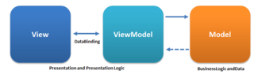

# MVVM-Sample

MVVM (Model View ViewModel) is an architectural pattern based on MVC and MVP, which attempts to more clearly separate the development of user-interfaces (UI) from that of the business logic and behaviour in an application. 

 

Special Thanks
-----
* Uncle Bob

Developed By
-----

Antonio Corrales desarrollogit@gmail.com

License
=======

Copyright 2014 Antonio Corrales

    Licensed under the Apache License, Version 2.0 (the "License");
    you may not use this file except in compliance with the License.
    You may obtain a copy of the License at

       http://www.apache.org/licenses/LICENSE-2.0

    Unless required by applicable law or agreed to in writing, software
    distributed under the License is distributed on an "AS IS" BASIS,
    WITHOUT WARRANTIES OR CONDITIONS OF ANY KIND, either express or implied.
    See the License for the specific language governing permissions and
    limitations under the License.
